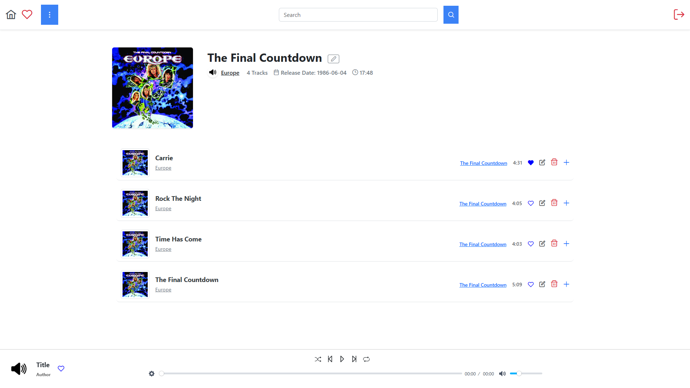

# SpringBootMusicApp

SpringBootMusicApp is a music streaming application built with a Spring Boot backend and an Angular frontend. It provides users with the ability to browse, play, and manage their music library.

## Features

- User authentication and authorization
- Music library management
- Playlist creation and management
- Music playback
- Responsive frontend built with Angular

## Screenshots

### Some screenshots from app





## Project Structure

- **Backend**: Spring Boot application providing RESTful APIs for the frontend
- **Frontend**: Angular application for the user interface

## Installation

### Prerequisites

- Java 18 or higher
- Node.js and npm
-  Docker (Optional)
- Angular CLI
### Docker

* If you have installed docker on your PC, you can use the [docker-compose](docker-compose.yml) file:
```sh
docker compose up
```

### Backend

1. Clone the repository:
    ```sh
    git clone https://github.com/HheZi/SpringBootMusicApp.git
    cd SpringBootMusicApp/Backend
    ```

2. Build the project:
    ```sh
    ./gradlew clean build
    ```

3. Create all databases in PostgresSQL

4. Run Kafka in container  (If you don't have docker, run Kafka installed localy on your machine)
    ```sh
    cd ./Backend/
    docker compose up
    ```

5. Run the application:
    ```sh
    ./gradlew bootRun
    ```

### Frontend

1. Navigate to the Frontend directory:
    ```sh
    cd SpringBootMusicApp/Frontend
    ```

2. Install dependencies:
    ```sh
    npm install
    ```

3. Run the development server:
    ```sh
    ng serve
    ```

4. Navigate to `http://localhost:4200/home` in your web browser.

## Usage

- Register or log in to your account
- Create new authors, albums and music
- Browse and search for music
- Create and manage playlists
- Add to favorites tracks
- Play your favorite songs

## Contributing

Contributions are welcome! Please fork the repository and submit a pull request.